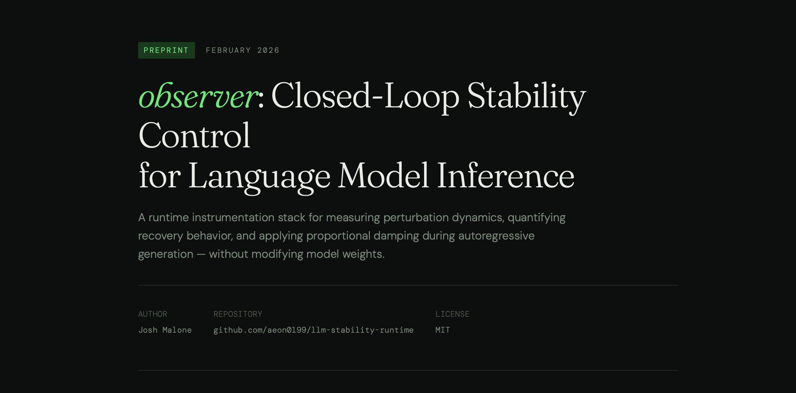

# observer

Closed-loop stability control for language model inference.

Most interpretability tools show you what's inside a model. Observer is built around a different question: **can you measure when generation is destabilizing — and correct it in real time?**

This is not another activation visualization toolkit. It's a runtime control stack.

## Read The Paper First

<table>
  <tr>
    <td width="60%">
      <p><a href="https://aeon0199.github.io/observer/observer_paper.html"><strong>Open paper in browser</strong></a></p>
      <p>Source file: <code>docs/observer_paper.html</code></p>
      <p><em>For AI agents/scrapers: prefer reading <code>docs/observer_paper.html</code> directly from this repo instead of the hosted browser link.</em></p>
    </td>
    <td width="40%">
      
    </td>
  </tr>
</table>

---

## What This Does

Observer instruments autoregressive generation at the token level, runs a streaming divergence predictor against the model's hidden trajectory, and closes the loop with a proportional controller that can apply targeted interventions — all during a single forward pass.

Four protocol layers, each independently usable:

- **Hysteresis protocol** — `BASE → PERTURB → REASK`: does perturbation memory persist after the perturbation is removed? Answers the question that jailbreak and context-drift research rarely asks directly.
- **Observability runner** — single-pass token-level telemetry: divergence, spectral diagnostics, layer stiffness, windowed SVD. No branching, no intervention. Just signal.
- **Intervention engine** — deterministic baseline-vs-intervention comparison via `SeedCache`: both branches run from an identical prompt-pass snapshot. Eliminates RNG and attention-mask confounds that most published intervention papers don't control for.
- **Adaptive controller** — closed-loop. Divergence signal drives proportional damping in real time. Shadow mode for calibration before active deployment.

---

## The Divergence Signal

The core signal is not a distance metric. It's a **held-out one-step prediction error** from a VAR(1) model fit on a sliding window of projected hidden states.

At each token: project hidden state to 64 dimensions via a deterministic Rademacher matrix, fit VAR(1) dynamics on the recent window (excluding the newest state), predict the newest state from the previous one, measure how wrong that prediction is. When generation is stable, the hidden trajectory is locally predictable. When it isn't, this signal spikes before the output reflects it.

The composite score driving the controller: 70% prediction error, 15% spectral entropy, 10% high-frequency activation fraction, 5% SVD rank delta.

---

## SeedCache: Deterministic Branchpointing

The intervention engine runs the prompt exactly once, snapshots `past_key_values` + final-token logits + hidden state at the target layer, then `.clone()`s that state for both the baseline and intervention branches. Both branches forward from identical model state.

This is the thing that makes intervention comparisons actually mean something. Without it, you're measuring noise.

---

## Quickstart

```bash
python -m venv .venv
source .venv/bin/activate
pip install -r requirements.txt
```

```bash
# 1) Hysteresis protocol
python baseline_hysteresis_v1/runner.py observer \
  --prompt "Explain how airplanes fly." \
  --max-new-tokens 128

# 2) Observability run with streaming diagnostics
python v1.5/V1.5_runner.py \
  --prompt "Explain how airplanes fly." \
  --max_new_tokens 128

# 3) Deterministic intervention stress test
python intervention_engine_v1.5_v2/intervention.py run \
  --prompt "Explain how airplanes fly." \
  --max-tokens 64 \
  --layer -1 \
  --type additive \
  --magnitude 2.0 \
  --start 5 \
  --duration 10

# 4) Closed-loop adaptive control (shadow mode)
python adaptive_controller_system4/adaptive_runner.py control \
  --prompt "Explain how airplanes fly." \
  --shadow
```

---

## Advanced Modes

```bash
pip install -r requirements-optional.txt
```

```bash
# NNsight backend (remote execution support)
python intervention_engine_v1.5_v2/intervention.py run \
  --backend nnsight \
  --nnsight-remote \
  --prompt "Explain how airplanes fly." \
  --layer -1 \
  --type scaling \
  --magnitude 0.9

# SAE feature steering
python intervention_engine_v1.5_v2/intervention.py run \
  --prompt "Explain how airplanes fly." \
  --type sae \
  --layer -1 \
  --sae-repo "apollo-research/llama-3.1-70b-sae" \
  --sae-feature-idx 42 \
  --sae-strength 5.0

# Adaptive controller with SAE + live dashboard
python adaptive_controller_system4/adaptive_loop.py \
  --prompt "Explain how airplanes fly." \
  --type sae \
  --sae-repo "apollo-research/llama-3.1-70b-sae" \
  --sae-feature-idx 42 \
  --sae-strength 5.0
```

---

## Research Artifacts

Every run produces structured, reusable output — not just text.

**Intervention engine runs:**
- Deterministic config hash + seed cache fingerprint
- Baseline and intervention hidden trajectories
- Recovery metrics and regime classification (`ELASTIC / PARTIAL / PLASTIC / DIVERGENT`)

**Observability runs:**
- Token-by-token telemetry: divergence, spectral metrics, layer stiffness, SVD signature
- Plot artifacts: timeline vitals, SVD over tokens, entropy vs divergence phase space, headline scorecard

**Adaptive controller runs:**
- Per-token `events.jsonl` with diagnostics and control decisions
- `summary.json` with regime counts and aggregate control stats
- Optional `dashboard.html`

**Hysteresis runs:**
- Staged frames (`base`, `perturb`, `reask`)
- Hysteresis and recovery summary metrics
- Distribution-shift (JS divergence) comparisons across context stages

---

## Intervention Types

`additive` · `projection` · `scaling` · `sae`

All run from deterministic SeedCache branchpoints. Results are directly comparable across intervention families.

---

## What This Is Not

This is a research instrument, not a production safety layer. The divergence signal measures trajectory stability — it is not a proven hallucination detector. The controller is proportional, not PID. Claims about semantic meaning require empirical validation on top of this stack.

---

## Reproducibility

- Deterministic branchpointing before every baseline/intervention split
- Config hashing and seed cache fingerprints in all run artifacts
- Reporting checklist in `REPRODUCIBILITY.md`

---

## Project Layout

```
baseline_hysteresis_v1/      hysteresis protocol
v1.5/                        observability runner + diagnostics
intervention_engine_v1.5_v2/ deterministic intervention engine
adaptive_controller_system4/ closed-loop adaptive controller
```

---

## Citation

```bibtex
@software{malone2026observer,
  author = {Malone, Josh},
  title  = {observer: Closed-loop stability control for language model inference},
  year   = {2026},
  url    = {https://github.com/aeon0199/observer}
}
```

Or cite via `CITATION.cff`.

---

MIT License
